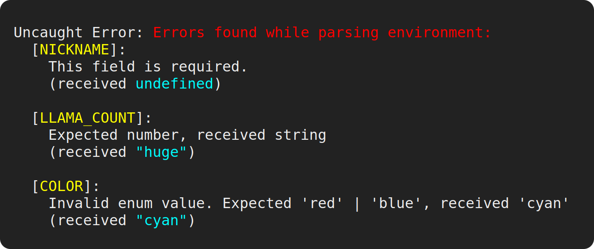

# znv

<p align="center">

</p>

<p align="center">
<a href="https://www.npmjs.com/package/znv">

</a>
</p>

Parse your environment with [Zod](https://github.com/colinhacks/zod).

Pass in a schema and your `process.env`. Get back a validated, type-safe,
read-only environment object that you can export for use in your app. You can
optionally provide defaults (which can be matched against `NODE_ENV` values like
`production` or `development`), as well as help strings that will be included in
the error thrown when an env var is missing.

## Status

Unstable: znv has not yet hit v1.0.0, and per semver there may be breaking
changes in minor versions before the v1.0.0 release. Any (known) breaking
changes will be documented in release notes. znv is used in production in
several services at the primary author's workplace. Feedback and suggestions
about final API design are welcome.

## Contents

- [Quickstart](#quickstart)
- [Motivation](#motivation)
- [Usage](#usage)
  - [`parseEnv`](#parseenvenvironment-schemas)
  - [Extra schemas](#extra-schemas)
- [Coercion rules](#coercion-rules)
- [Comparison to other libraries](#comparison-to-other-libraries)
- [Complementary tooling](#complementary-tooling)
- [How do I pronounce znv?](#how-do-i-pronounce-znv)

## Quickstart

```bash
npm i znv zod
# or
yarn add znv zod
```

Create a file named something like `env.ts`:

```ts
import { parseEnv } from "znv";
import { z } from "zod";

export const { NICKNAME, LLAMA_COUNT, COLOR, SHINY } = parseEnv(process.env, {
  NICKNAME: z.string().min(1),
  LLAMA_COUNT: z.number().int().positive(),
  COLOR: z.enum(["red", "blue"]),
  SHINY: z.boolean().default(true),
});

console.log([NICKNAME, LLAMA_COUNT, COLOR, SHINY].join(", "));
```

Let's run this with [ts-node](https://github.com/TypeStrong/ts-node):

```
$ LLAMA_COUNT=huge COLOR=cyan ts-node env.ts
```



Oops! Let's fix those issues:

```
$ LLAMA_COUNT=24 COLOR=red NICKNAME=coolguy ts-node env.ts
```

Now we see the expected output:

```
coolguy, 24, red, true
```

Since `parseEnv` didn't throw, our exported values are guaranteed to be defined.
Their TypeScript types will be inferred based on the schemas we used — `COLOR`
will be even be typed to the union of literal strings `'red' | 'blue'` rather
than just `string`.

---

A more elaborate example:

```ts
// znv re-exports zod as 'z' to save a few keystrokes.
import { parseEnv, z, port } from "znv";

export const { API_SERVER, HOST, PORT, EDITORS, POST_LIMIT, AUTH_SERVER } =
  parseEnv(process.env, {
    // you can provide defaults with `.default()`. these will be validated
    // against the schema.
    API_SERVER: z.string().url().default("https://api.llamafy.biz"),

    // specs can also be more detailed.
    HOST: {
      schema: z.string().min(1),

      // the description is handy as in-code documentation, but is also printed
      // to the console if validation for this env var fails.
      description: "The hostname for this service.",

      // instead of specifying defaults as part of the zod schema, you can pass
      // them in the `defaults` object. a default will be matched based on the
      // value of `NODE_ENV`.
      defaults: {
        production: "my-cool-llama.website",
        test: "cool-llama-staging.cloud-provider.zone",

        // "_" is a special token that can be used in `defaults`. its value will
        // be used if `NODE_ENV` doesn't match any other provided key.
        _: "localhost",
      },
    },

    // znv provides helpers for a few very common environment var types not
    // covered by zod. these can have further refinements chained to them:
    PORT: port().default(8080),

    // using a zod `array()` or `object()` as a spec will make znv attempt to
    // `JSON.parse` the env var if it's present.
    EDITORS: z.array(z.string().min(1)),

    // optional values are also supported and provide a way to benefit from the
    // validation and static typing provided by zod even if you don't want to
    // error out on a missing value.
    POST_LIMIT: z.number().optional(),

    // use all of the expressiveness of zod, including enums and post-processing.
    AUTH_SERVER: z
      .enum(["prod", "staging"])
      .optional()
      .transform((prefix) =>
        prefix ? `http://auth-${prefix}.cool-llama.app` : "http://localhost:91"
      ),
  });
```

If any env var fails validation, `parseEnv()` will throw. All failing specs will
be aggregated in the error message, with each showing the received value, the
reason for the failure, and a hint about the var's purpose (if `description` was
provided in the spec).

## Motivation

Environment variables are one way to pass runtime configuration into your
application. As [promoted by the Twelve-Factor App
methodology](https://12factor.net/config), this helps keep config (which can
vary by deployment) cleanly separated from code, encouraging maintainable
practices and better security hygiene. But passing in configuration via env vars
can often turn into an ad-hoc affair, with access and validation scattered
across your codebase. At worst, a misconfigured environment will launch and run
without apparent error, with issues only making themselves apparent later when a
certain code path is hit. A good way to avoid this is to **declare and validate
environment variables in one place** and export the validated result, so that
other parts of your code can make their dependencies on these vars explicit.

Env vars represent one of the _boundaries_ of your application, just like file
I/O or a server request. In TypeScript, as in many other typed languages, these
boundaries present a challenge to maintaining a well-typed app.
[Zod](https://github.com/colinhacks/zod) does an excellent job at parsing and
validating poorly-typed data at boundaries into clean, well-typed values. znv
facilitates its use for environment validation.

### What does znv actually do?

znv is a small module that works hand-in-hand with Zod. Since env vars, when
defined, are always strings, Zod schemas like `z.number()` will fail to parse
them out-of-the-box. Zod allows you to use a [`preprocess`
schema](https://github.com/colinhacks/zod#preprocess) to handle coercions, but
peppering your schemas with preprocessors to this end is verbose, error-prone,
and clunky. znv wraps each of the Zod schemas you pass to `parseEnv` in a
preprocessor that tries to coerce a string to a type the schema expects.

These preprocessors don't do any validation of their own — in fact, they try to
do as little work as possible and defer to your schema to handle the validation.
In practice, this should be pretty much transparent to you, but you can check
out the [coercion rules](#coercion-rules) if you'd like more info.

znv also makes it easy to define defaults for env vars based on your
environment. Zod allows you to add a default value for a schema, but making a
given default vary by environment or only act as a fallback in certain
environments is not straightforward.

## Usage

### `parseEnv(environment, schemas)`

Parse the given `environment` using the given `schemas`. Returns a read-only
object that maps the keys of the `schemas` object to their respective parsed
values.

Throws if any schema fails to parse its respective env var. The error aggregates
all parsing failures for the schemas.

#### `environment: Record<string, string | undefined>`

You usually want to pass in `process.env` as the first argument.

> **It is not recommended** to use znv for general-purpose schema validation —
> just use Zod (with
> [preprocessors](https://github.com/colinhacks/zod#preprocess) to handle
> coercion, if necessary).

#### `schemas: Record<string, ZodType | DetailedSpec>`

Maps env var names to validators. You can either use a Zod schema directly, or
pass a `DetailedSpec` object that has the following fields:

- `schema: ZodType`

  The Zod validator schema.

- `description?: string`

  Optional help text that will be displayed when this env var is missing or
  fails to validate.

- `defaults?: Record<string, SchemaInput | undefined>`

  An object that maps from `NODE_ENV` values to values that will be passed as
  input to the schema if this var isn't present in the environment. For example:

  ```ts
  const schemas = {
    FRUIT: {
      schema: z.string().min(1),
      defaults: {
        production: "orange",
        development: "banana",
      },
    },
  };

  // FRUIT wll have value "banana".
  const { FRUIT } = parseEnv({ NODE_ENV: "development" }, schemas);

  // FRUIT wll have value "orange".
  const { FRUIT } = parseEnv({ NODE_ENV: "production" }, schemas);

  // FRUIT wll have value "fig".
  const { FRUIT } = parseEnv({ NODE_ENV: "production", FRUIT: "fig" }, schemas);

  // FRUIT wll have value "apple".
  const { FRUIT } = parseEnv({ FRUIT: "apple" }, schemas);

  // this will throw, since NODE_ENV doesn't match "production" or "development".
  const { FRUIT } = parseEnv({}, schemas);
  ```

  `defaults` accepts a special token as a key: `_`. This is like the `default`
  clause in a `switch` case — its value will be used if `NODE_ENV` doesn't match
  any other key in `defaults`.

  > (As an aside, it is **not recommended** to use `staging` as a possible value
  > for `NODE_ENV`. Your staging environment should be as similar to your
  > production environment as possible, and `NODE_ENV=production` has special
  > meaning for several tools and libraries. For example,
  > [`npm install`](https://docs.npmjs.com/cli/v8/commands/npm-install) and
  > [`yarn install`](https://classic.yarnpkg.com/en/docs/cli/install#toc-yarn-install-production-true-false)
  > by default won't install `devDependencies` if `NODE_ENV=production`;
  > [Express](https://expressjs.com/en/advanced/best-practice-performance.html#set-node_env-to-production)
  > and [React](https://reactjs.org/docs/optimizing-performance.html) will also
  > behave differently depending on whether `NODE_ENV` is `production` or not.
  > Instead, your staging environment should also set `NODE_ENV=production`, and
  > you should define your own env var(s) for any special configuration that's
  > necessary for your staging environment.)

  Caveats aside, `_` lets you express a few interesting scenarios:

  ```ts
  // one default for production, and one for all other environments, including
  // development and testing.
  { production: "prod default", _: "dev default" }

  // default for all non-production environments, but require the var to be
  // passed in for production.
  { production: undefined, _: "dev default" }

  // unconditional default. equivalent to adding `.default("some default")`
  // to the zod schema, but this might be more stylistically consistent with
  // your other specs if they use the `defaults` field.
  { _: "unconditional default" }
  ```

  Some testing tools like [Jest](https://jestjs.io/) set `NODE_ENV` to `test`,
  so you can also use `defaults` to provide default env vars for testing.

  `parseEnv` doesn't restrict or validate `NODE_ENV` to any particular values,
  but you can add `NODE_ENV` to your schemas like any other env var. For
  example, you could use
  `NODE_ENV: z.enum(["production", "development", "test", "ci"])` to enforce
  that `NODE_ENV` is always defined and is one of those four expected values.

### Extra schemas

znv exports a very small number of extra schemas for common env var types.

#### `port()`

`port()` is an alias for `z.number().int().nonnegative().lte(65535)`.

#### `deprecate()`

`deprecate()` is an alias for
`z.undefined().transform(() => undefined as never)`. `parseEnv` will throw if a
var using the `deprecate()` schema is passed in from the environment.

## Coercion rules

znv tries to do as little work as possible to coerce env vars (which are always
strings when they're present) to the [input
types](https://github.com/colinhacks/zod#what-about-transforms) of your schemas.
If the env var doesn't look like the input type, znv will pass it to the
validator as-is with the assumption that the validator will throw. For example,
if your schema is `z.number()`, znv will test it against a numeric regex first,
rather than unconditionally wrap it in `Number()` or `parseFloat()` (and thus
coerce it to `NaN`).

By modifying as little as possible, znv tries to get out of Zod's way and let it
do the heavy lifting of validation. This also lets us produce less confusing
error messages: if you pass the string "banana" to your number schema, it should
be able to say "you gave me 'banana' instead of a number!" rather than "you gave
me NaN instead of a number!"

**Coercions only happen at the top level of a schema**. If you define an object
with nested schemas, no coercions will be applied to the keys.

Some notable coercion mechanics:

- If your schema's input is a boolean, znv will coerce `"true"`, `"yes"` and
  `"1"` to `true`, and `"false"`, `"no"` and `"0"` to `false`. All other values
  will be passed through.

  > Some CLI tool conventions dictate that a variable simply being present in
  > the environment (even with no value, eg. setting `MY_VALUE=` with no
  > right-hand side) should be interpreted as `true`. However, this convention
  > doesn't seem to be in widespread use in Node, probably because it causes the
  > var to evaluate to the empty string (which is falsy). znv demands a little
  > more specificity by default, while still hedging a bit for some common
  > true/false equivalents. If you want the "any defined value" behaviour, you
  > can use
  > `z.string().optional().transform(v => v === undefined ? false : true)`.

- If your schema's input is an object or array (or record or tuple), znv will
  attempt to `JSON.parse` the input value if it's not `undefined` or the empty
  string.

  > **Remember, with great power comes great responsibility!** If you're using
  > an object or array schema to pass in dozens or hundreds of kilobytes of data
  > as an env var, you may be doing something wrong. (Certain platforms also
  > [impose limits on environment variable
  > length](https://devblogs.microsoft.com/oldnewthing/20100203-00/?p=15083).)

- If your schema's input is a Date, znv will call `new Date()` with the input
  value. This has a number of pitfalls, since the `Date()` constructor is
  excessively forgiving. The value is passed in as a string, which means trying
  to pass a Unix epoch will yield unexpected results. (Epochs need to be passed
  in as `number`: `new Date()` with an epoch as a string will either give you
  `invalid date` or a completely nonsensical date.) _You should only pass in ISO
  8601 date strings_, such as those returned by
  [`Date.prototype.toISOString()`](https://developer.mozilla.org/en-US/docs/Web/JavaScript/Reference/Global_Objects/Date/toISOString).
  Improved validation for Date schemas could be added in a future version.

- Zod defines "nullable" as distinct from "optional". If your schema is
  `nullable`, znv will coerce `undefined` to `null`. Generally it's preferred to
  simply use `optional`.

## Comparison to other libraries

### [Envalid](https://github.com/af/envalid)

Envalid is a nice library that inspired znv's API design. Envalid is written in
TypeScript and performs some inference of the return value based on the
validator schema you pass in, but won't do things like narrow enumerated types
(`str({ choices: ['a', 'b'] })`) to a union of literals. Expressing defaults is
more limited (you can't have different defaults for `test` and `development`
environments, for example). Defaults are not passed through validators.

Envalid's validators are built-in and express a handful of types with limited
options and no ability to perform postprocessing. For other use cases you have
to write your own [custom
validators](https://github.com/af/envalid#custom-validators).

Envalid wraps its return value in a proxy, which can't be opted out of and has
some [surprising effects](https://github.com/af/envalid/issues/177).

### [Joi](https://joi.dev/)

Joi is the Cadillac of schema validation libraries. Its default of coercing
strings to the target type makes it easy to adopt for environment validation.
Unfortunately, Joi is written in JavaScript and its type definitions support a
very limited form of inference when they work at all.

## Complementary tooling

The [eslint-plugin-node](https://github.com/mysticatea/eslint-plugin-node) rule
[`no-process-env`](https://github.com/mysticatea/eslint-plugin-node/blob/master/docs/rules/no-process-env.md)
is recommended to restrict usage of `process.env` outside of the module that
parses your schema.

znv also works great with [dotenv](https://github.com/motdotla/dotenv).

## How do I pronounce znv?

If you usually pronounce "z" as "zed," then you could say "zenv." If you usually
pronounce "z" as "zee," you could say "zee en vee."

Or do your own thing. I'm not the boss of you.
